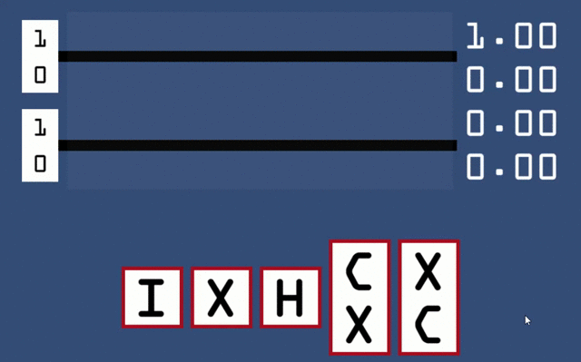

# Quantum Computing Vis

A small toy example of a quantum circuit simulator (enough to implement Deutsch's algorithm!). Hosted online by Github pages at [jxz12.github.io/QuantumVis](https://jxz12.github.io/QuantumVis).
